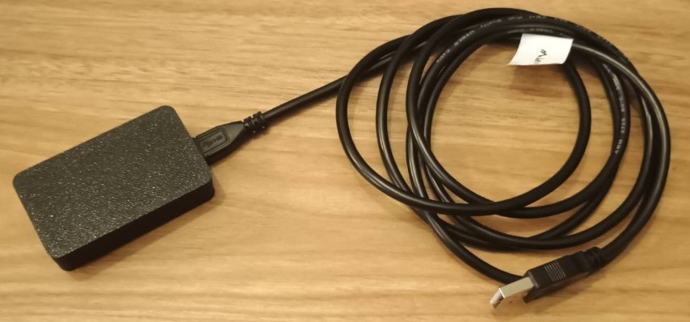
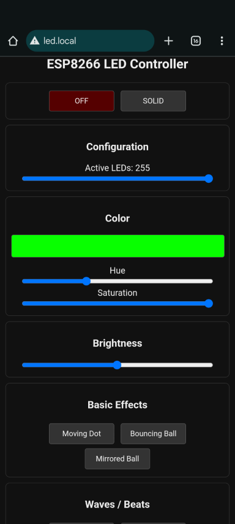

## Instrukcja Uruchomienia (Sterowanie paskami LED z użyciem telefonu)

1.  **Zasilanie:** Podpinamy paski LED do prądu z użyciem wtyczek będących w zestawie.
2.  **Podłączenie sterownika:** Korzystając z kabla USB podpinamy płytkę (płytka zamknięta w plastikowej obudowie) do zasilania (port USB / power bank / ładowarka).
  

3.  **Połączenie WiFi:** Po podłączeniu łączymy telefon do sieci WiFi generowanej przez płytkę.
    *   Nazwa sieci: `LED_MASTER`
    *   Hasło: `12345678`
    *(Wyłączenie danych komórkowych w telefonie może pomóc w stabilniejszym połączeniu z siecią WiFi płytki.)*

4.  **Panel Sterowania:** W przeglądarce telefonu otwieramy adres: `led.local`

5.  **Obsługa:** Strona do sterowania pozwala na:
    *   odtwarzanie różnych efektów świetlnych na paskach LED
    *   zmianę aktualnego koloru poprzez zmianę wartości dla Hue, Saturation i Brightness
    *   zmianę ilości wykorzystanych diod LED na pasku

