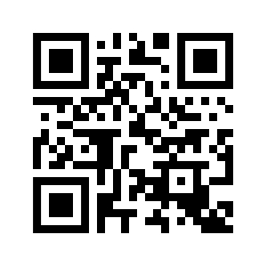

## Sterowanie paskami LED z użyciem telefonu

- Podpinamy paski LED do prądu z użyciem wtyczek będących w zestawie.

- Korzystając z kabla USD podpinamy płytkę do zasilania (port UDS / power bank / ładowarka).

- Po podłączeniu łączymy telefon do sieci WiFi generowanej przez płytkę.
  - Nazwa sieci: `LED_MASTER`
  - Hasło: `12345678`

Pomocniczy kod QR:

- W przeglądarce telefonu otwieramy adres: `http://192.168.4.1/`

84