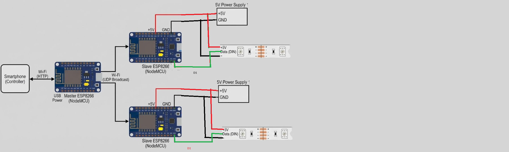
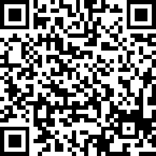
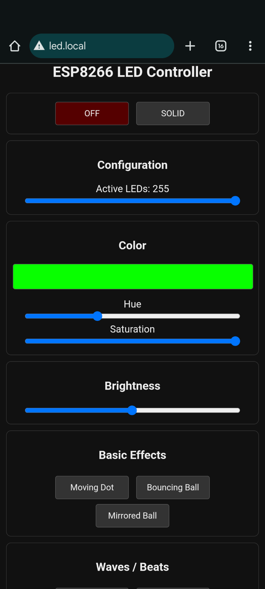

# Uniwersytet Bielsko-Bialski

  

# Sprawozdanie
## Rozszerzony Internet rzeczy

    

**Data:** 29.01.2026

 

**Temat:** Przeprogramować efekty RGB

     

**Mikołaj Zuziak, Adrian Raszka**  
Informatyka II stopień, stacjonarne,  
2 semestr, grupa: SZI

## Cel
Poprawienie działania połączenia pomiędzy masterem, a slavem, dodanie nowych efektów do ledów, wydrukowanie obudowy na mastera.

## Realizacja

### Pierwotne założenie
Projektowe opierało się na wykorzystaniu modułu ESP32 jako jednostki centralnej (Master) oraz modułów ESP8266 jako odbiorników (Slave). Komunikacja miała odbywać się dwuetapowo: od smartfona do Mastera, a następnie z Mastera do urządzeń wykonawczych za pośrednictwem sieci WiFi.

Podczas testów prototypu napotkano jednak problemy z utrzymaniem stabilności połączenia w tej konfiguracji. Próby synchronizacji wielu standardów i zarządzania ruchem sieciowym przez ESP32 nie zapewniały oczekiwanej płynności przesyłu danych, co objawiało się opóźnieniami w reakcji diod LED, a czasem całkowitym brakiem reakcji.

### Rozwiązanie docelowe
W celu optymalizacji stabilności zdecydowano się na zmianę jednostki centralnej na moduł ESP8266 i przebudowanie modelu komunikacji. W obecnej architekturze Master pełni rolę Punktu Dostępowego (Access Point) oraz hostuje serwer WWW.

**Kluczowe cechy nowego rozwiązania:**

*   **Bezpośredni interfejs:** Sterowanie odbywa się poprzez responsywną stronę internetową hostowaną bezpośrednio na module Master.
*   **Protokół UDP:** Do komunikacji z modułami Slave wykorzystano protokół UDP (User Datagram Protocol) w trybie broadcast. Pozwala to na niemal natychmiastowe przesyłanie rozkazów do wszystkich odbiorników jednocześnie bez konieczności nawiązywania złożonych sesji.
*   **Obsługa mDNS:** Dzięki implementacji usługi DNS użytkownik nie musi pamiętać adresu IP urządzenia. Dostęp do panelu sterowania uzyskuje się poprzez wpisanie w przeglądarce przyjaznego adresu `http://led.local`.

### Specyfikacja techniczna

| Parametr | Wartość / Opis |
| :--- | :--- |
| **Tryb WiFi** | Access Point (SoftAP) |
| **SSID (Nazwa sieci)** | LED_MASTER |
| **Hasło WiFi** | 12345678 |
| **Adres mDNS** | http://led.local |
| **Protokół komunikacji** | UDP Broadcast |
| **Port UDP** | 4210 |
| **Adres rozgłoszeniowy** | 192.168.4.255 |
| **Maksymalna liczba LED** | 85 (konfigurowalna z poziomu UI) |

### Interfejs użytkownika
Strona WWW została zaprojektowana w sposób minimalistyczny, zapewniając pełną kontrolę nad oświetleniem. Umożliwia ona:

*   **Zarządzanie barwą:** Wybór odcienia (Hue) oraz nasycenia (Saturation) w czasie rzeczywistym.
*   **Regulację jasności:** Płynny suwak sterujący intensywnością świecenia.
*   **Wybór efektów:** Dostęp do predefiniowanych trybów, takich jak Fire, Matrix Rain, Police Strobe czy Rainbow Beat.
*   **Konfigurację sprzętową:** Dynamiczne ograniczanie liczby aktywnych punktów LED.

Struktura danych przesyłanych protokołem UDP została zoptymalizowana za pomocą struktury `ControlPacket`, co minimalizuje narzut danych i zapewnia płynne przejścia między efektami.

### Schemat projektu

## Instrukcja Uruchomienia (Sterowanie paskami LED z użyciem telefonu)

1.  **Zasilanie:** Podpinamy paski LED do prądu z użyciem wtyczek będących w zestawie.
2.  **Podłączenie sterownika:** Korzystając z kabla USB podpinamy płytkę do zasilania (port USB / power bank / ładowarka).
3.  **Połączenie WiFi:** Po podłączeniu łączymy telefon do sieci WiFi generowanej przez płytkę.
    *   Nazwa sieci: `LED_MASTER`
    *   Hasło: `12345678`
    *(Wyłączenie danych komórkowych w telefonie może pomóc w stabilniejszym połączeniu z siecią WiFi płytki.)*

4.  **Panel Sterowania:** W przeglądarce telefonu otwieramy adres: `led.local`

5.  **Obsługa:** Strona do sterowania pozwala na:
    *   odtwarzanie różnych efektów świetlnych na paskach LED
    *   zmianę aktualnego koloru poprzez zmianę wartości dla Hue, Saturation i Brightness
    *   zmianę ilości wykorzystanych diod LED na pasku

## Wnioski

1.  **Poprawa stabilności komunikacji:** Przejście na architekturę opartą o moduł ESP8266 działający jako Access Point oraz wykorzystanie protokołu UDP Broadcast rozwiązało problemy z opóźnieniami i zrywaniem połączenia, które występowały w pierwotnej wersji opartej o ESP32 i TCP. Protokół bezpołączeniowy sprawdza się znacznie lepiej w zastosowaniach czasu rzeczywistego, takich jak sterowanie oświetleniem.
2.  **Zwiększenie ergonomii użytkowania:** Implementacja usługi mDNS (`led.local`) oraz hostowanie responsywnego interfejsu Web bezpośrednio na mikrokontrolerze wyeliminowało potrzebę instalowania dedykowanych aplikacji mobilnych. Ułatwia to szybkie rozpoczęcie korzystania z systemu przez dowolnego użytkownika podłączonego do sieci.
3.  **Efektywność przesyłu danych:** Zastosowanie zoptymalizowanej struktury danych (`ControlPacket`) oraz mechanizmu broadcast pozwala na jednoczesne i synchroniczne sterowanie wieloma taśmami LED przy minimalnym obciążeniu sieci, co zapewnia płynność animacji nawet przy dużej liczbie efektów świetlnych.
